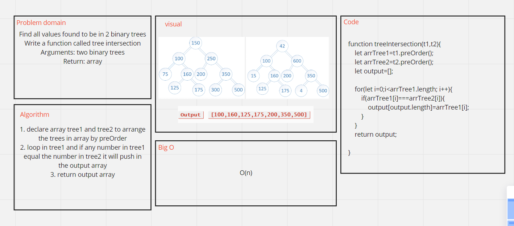

# Challenge Summary
<!-- Description of the challenge -->
Find all values found to be in 2 binary trees
Write a function called tree intersection
Arguments: two binary trees
Return: array

## Whiteboard Process
<!-- Embedded whiteboard image -->

## Approach & Efficiency
<!-- What approach did you take? Why? What is the Big O space/time for this approach? -->
O(n)
