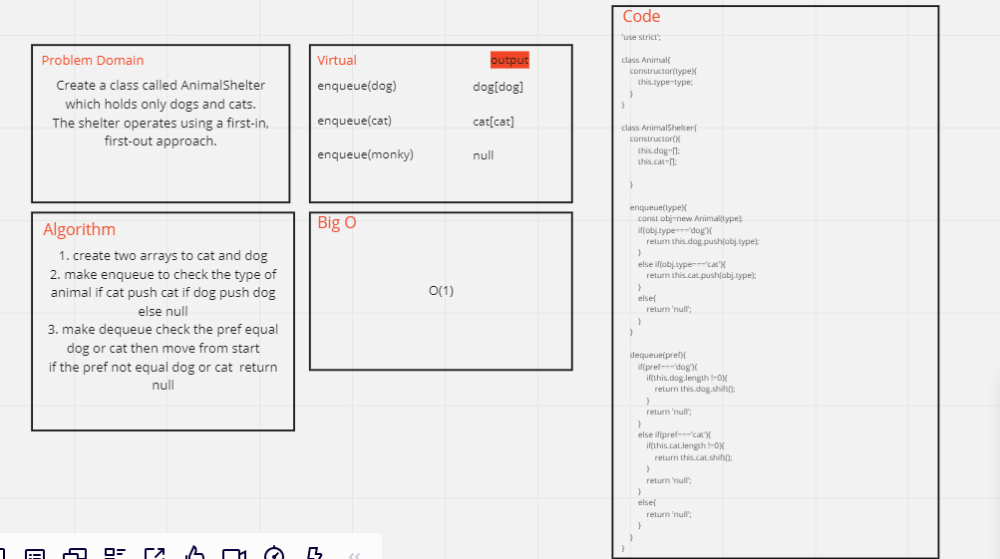

# Challenge Summary
<!-- Description of the challenge -->
Create a class called AnimalShelter which holds only dogs and cats.
The shelter operates using a first-in, first-out approach.

## Whiteboard Process
<!-- Embedded whiteboard image -->

## Approach & Efficiency
<!-- What approach did you take? Why? What is the Big O space/time for this approach? -->
O(1)
## Solution
<!-- Show how to run your code, and examples of it in action -->
`enqueue(dog)`  --->    `dog[dog]`

`enqueue(cat)`  --->    `cat[cat]`

`enqueue(monky)`--->    `null`

