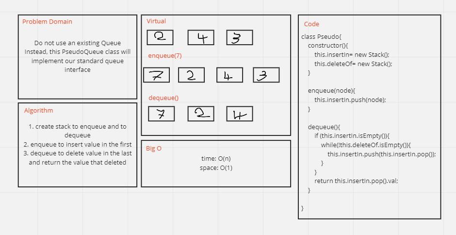

# Challenge Summary
<!-- Description of the challenge -->
Create Pseudo class with two methods enqueue/dequeue, and use Stack methods to implement it
## Whiteboard Process
<!-- Embedded whiteboard image -->

## Approach & Efficiency
<!-- What approach did you take? Why? What is the Big O space/time for this approach? -->
O(n)
O(1)

