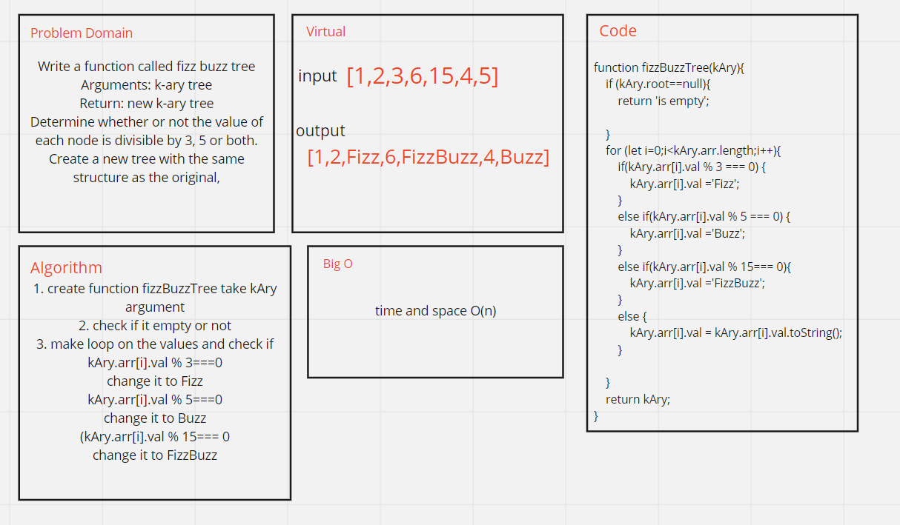

# Challenge Summary
<!-- Description of the challenge -->
Write a function called fizz buzz tree
Arguments: k-ary tree
Return: new k-ary tree
Determine whether or not the value of each node is divisible by 3, 5 or both. Create a new tree with the same structure as the original.

## Whiteboard Process
<!-- Embedded whiteboard image -->

## Approach & Efficiency
<!-- What approach did you take? Why? What is the Big O space/time for this approach? -->
O(n)
## Solution
<!-- Show how to run your code, and examples of it in action -->
input `[1,2,3,6,15,4,5]`
output `[1,2,Fizz,6,FizzBuzz,4,Buzz]`