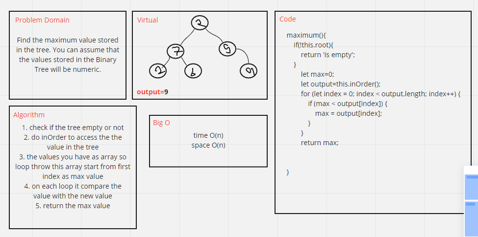

# Challenge Summary
<!-- Description of the challenge -->
Find the maximum value stored in the tree. You can assume that the values stored in the Binary Tree will be numeric.

## Whiteboard Process
<!-- Embedded whiteboard image -->

## Approach & Efficiency
<!-- What approach did you take? Why? What is the Big O space/time for this approach? -->
O(n)
## Solution
<!-- Show how to run your code, and examples of it in action -->
return the max number in the tree